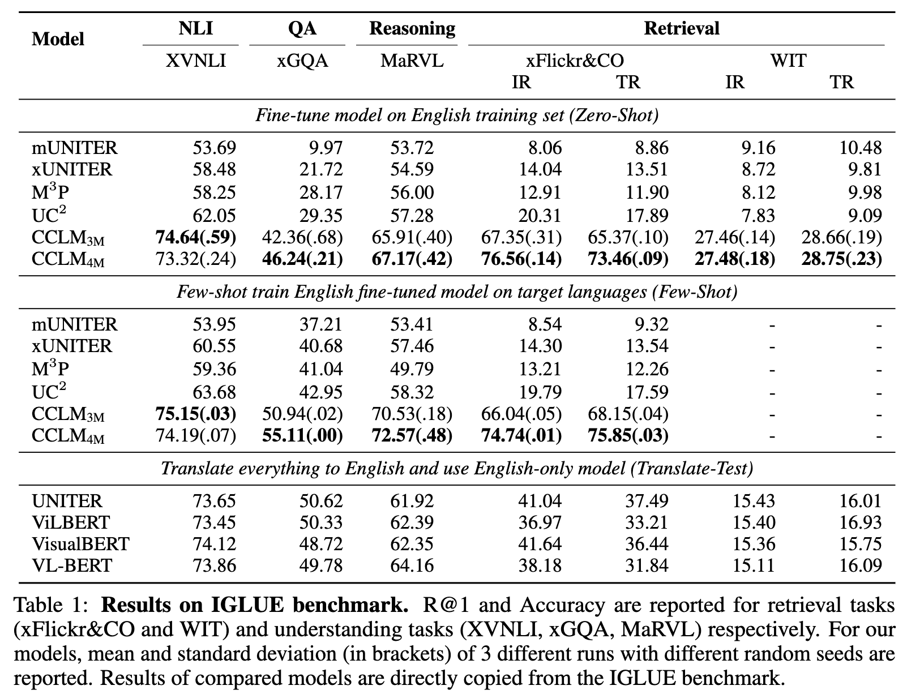
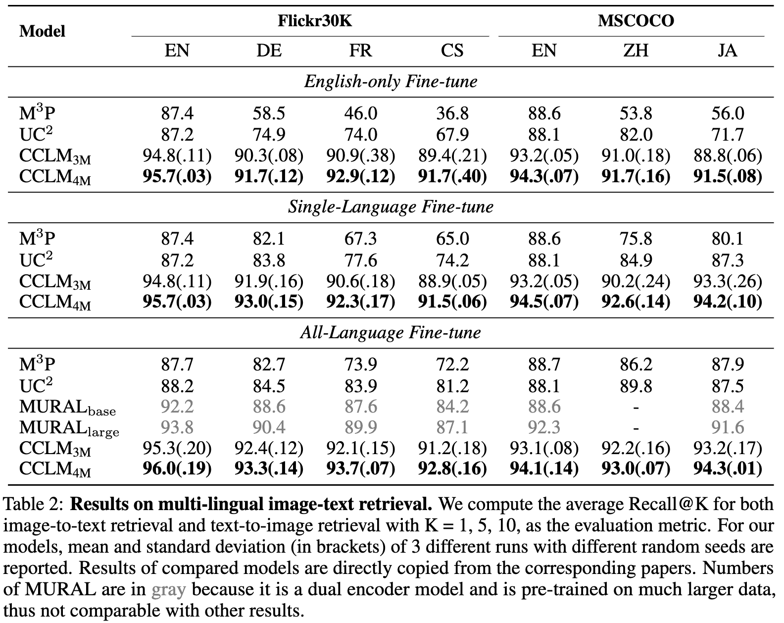

# CCLM: Towards Unified Cross-Lingual Cross-Modal Pre-training 


**[Cross-View Language Modeling: Towards Unified
Cross-Lingual Cross-Modal Pre-training](https://arxiv.org/abs/2206.00621). **Yan Zeng, Wangchunshu Zhou, Ao Luo, Xinsong Zhang arXiv 2022.**

- June 2022: release preprint in [arXiv](https://arxiv.org/abs/2206.00621) and official PyTorch implementation 


CCLM (base: 12L swin-base, 6L text, 6L fusion):  
[](https://paperswithcode.com/sota/zero-shot-cross-lingual-visual-reasoning-on?p=cross-view-language-modeling-towards-unified)
[](https://paperswithcode.com/sota/zero-shot-cross-lingual-visual-question?p=cross-view-language-modeling-towards-unified)
[](https://paperswithcode.com/sota/zero-shot-cross-lingual-visual-natural?p=cross-view-language-modeling-towards-unified)
[](https://paperswithcode.com/sota/zero-shot-cross-lingual-text-to-image?p=cross-view-language-modeling-towards-unified)
[](https://paperswithcode.com/sota/zero-shot-cross-lingual-image-to-text?p=cross-view-language-modeling-towards-unified)


<div align="center">
  
</div>

<div align="center">
  
</div>


## Hiring
We are looking for interns at ByteDance AI Lab (in Beijing / Shanghai)! If you are interested in working with us on vision language models, please send your resume to 
zengyan.yanne@bytedance.com.


## Requirements
- Install python3 environment
```angular2html
pip3 install -r requirements.txt
```
- Download data from corresponding websites
- If running pre-training scripts: 
  - install Apex
  - download pre-trained models for parameter initialization 
    - image encoder: [swin-transformer-base](https://github.com/SwinTransformer/storage/releases/download/v1.0.0/swin_base_patch4_window7_224_22k.pth)
    - text encoder: [xlm-roberta-large](https://huggingface.co/xlm-roberta-large)
- Organize these files like this:  
```angular2html
CCLM/
    data/
        xlm-roberta-large/...
        swin_base_patch4_window7_224_22k.pth
        multi30k/...
        mscoco/...
    
    iglue/
        datasets/...
    
    images/
        flickr30k-images/*.jpg
        
        coco/
            train2014/*.jpg
            val2014/*.jpg
            test2015/*.jpg
        
        marvl-images/
            id/
                images/...
                extra/...
            sw/...
            ta/...
            tr/...
            zh/...
        marvl_fewshot/
            id/
                3-Beo/...
                all/...
            tr/...
            zh/...
```

## Pretrain
```angular2html
# 3M
python3 run.py --task "pretrain_cclm_3m" --dist "1" --output_dir "output/"

# 4M
python3 run.py --task "pretrain_cclm_4m" --dist "1" --output_dir "output/"
```
For distributed training across nodes, see run.py for more details.


#### Data
To facilitate research on multi-lingual multi-modal pre-training, we provide the text translation of [COCO+VG+SBU+CC3M](https://drive.google.com/drive/folders/1W5qgif3u7Z9orlvj3zJ0dUCsrDJl8s4I?usp=sharing) and the filtered subset of [WikiMatrix](https://drive.google.com/drive/folders/1LvuN8WNgMW_RhqEdJucEVKJq0Sowni6s?usp=sharing).   

🌟 We implement CCLM(4M) following [X-VLM](https://github.com/zengyan-97/X-VLM). We also provide the text translation of [Object And Region Annotations](https://drive.google.com/drive/folders/1W4_wr53DDWLsvuSavNW1iDbSo9yXQQL1?usp=sharing). 

**Please cite the corresponding papers appropriately and download the images from their websites.**   

For more details, please read the code dataset/pretrain_dataset.py (more specifically ImageMultiTextDataset & RegionMultiTextDataset & ParaTextDataset) to see what format is needed.

#### Checkpoints
Following previous works, we pretrain the model for only 30 epochs on 8 A100 GPUs. The batch size is set to 1024.   
[CCLM (3M, 30 epochs)](https://drive.google.com/file/d/1sR-yyWnSFeyfSNo9K5O9VL-e_VOCHnk5/view?usp=sharing)  
[CCLM (4M, 30 epochs)](https://drive.google.com/file/d/1fZxxJMq_f3NpxM7qDDAHGULVwolN0Lbi/view?usp=sharing)


## Finetune
Please download MSCOCO, Multi30K, and IGLUE from the corresponding websites.  
We provide <u>**checkpoints (and logs) fine-tuned on English train set**</u>: [3M, TODO]() and [4M, TODO](). 

***
#### Data: MSCOCO and Multi30K 
For these two datasets, you need to additionally reformulate the train json files like this:
```
[
    {
        "caption": "A woman wearing a net on her head cutting a cake. ",
        "image": "coco/val2014/COCO_val2014_000000522418.jpg",
        "image_id": 522418
    }, ...
]
```
and the valid and test files like this: 
```
[
    {
        "image": "coco/val2014/COCO_val2014_000000391895.jpg",
        "caption": [
            "A man with a red helmet on a small moped on a dirt road. ",
            "Man riding a motor bike on a dirt road on the countryside.",
            "A man riding on the back of a motorcycle.",
            "A dirt path with a young person on a motor bike rests to the foreground of a verdant area with a bridge and a background of cloud-wreathed mountains. ",
            "A man in a red shirt and a red hat is on a motorcycle on a hill side."
        ],
        "image_id": 391895
    }, ...
]
```

***
#### Data: IGLUE 
For IGLUE, you just need to clone [this repo](https://github.com/e-bug/iglue) and place it in the root path of our repo as follows. Our code works on the original annotations of IGLUE without any preprocess.
```
CCLM/
    iglue/
        datasets/...
```
For MaRVL, please download the `marvl-images.zip` and `few-shot.zip` from the [download page](https://borealisdata.ca/dataset.xhtml?persistentId=doi:10.5683/SP3/42VZ4P), and extract them to `images` with name of `marvl-images` and `marvl_fewshot`.

For WIT, please download the `image_data_train.tar` and test images from its [kaggle](https://www.kaggle.com/c/wikipedia-image-caption/data) webpage, and extract them to `images`, `images/wit_test` seperately.

Tips for WIT:
- The download link of `image_data_train.tar` is in **Data Description**.
- You need to extract the files again in `images/image_data_train/image_pixels` and `iglue/datasets/wit/annotations/train_en.jsonl.zip`)

***
#### Retrieval Tasks: Multi30K and MSCOCO
```angular2html
# English-only Fine-tune
## Multi30K
python3 run.py --dist 1 --task itr_multi30k --config configs/cclm-base-ft/Retrieval_multi30k_en_ft.yaml --output_dir output/path/to/save --bs 128 --seed 42 --epoch 10 --checkpoint pretrained_model.th

## MSCOCO
python3 run.py --dist 1 --task itr_coco --config configs/cclm-base-ft/Retrieval_coco_en_ft.yaml --output_dir output/path/to/save --bs 128 --seed 42 --epoch 10 --checkpoint pretrained_model.th


# Single-Language Fine-tune
## Multi30K, optional language: cs/de/fr
python3 run.py --dist 1 --task itr_multi30k --config configs/cclm-base-ft/Retrieval_multi30k_cs_ft.yaml --output_dir output/path/to/save --bs 128 --seed 42 --epoch 10 --checkpoint pretrained_model.th

## MSCOCO, optional config: ja/zh
python3 run.py --dist 1 --task itr_coco --config configs/cclm-base-ft/Retrieval_coco_ja_ft.yaml --output_dir output/path/to/save --bs 128 --seed 42 --epoch 10 --checkpoint pretrained_model.th


# All-Language Fine-tune
## Multi30K
python3 run.py --dist 1 --task itr_multi30k --config configs/cclm-base-ft/Retrieval_multi30k_all_ft.yaml --output_dir output/path/to/save --bs 128 --seed 42 --epoch 10 --checkpoint pretrained_model.th

## MSCOCO
python3 run.py --dist 1 --task itr_coco --config configs/cclm-base-ft/Retrieval_coco_all_ft.yaml --output_dir output/path/to/save --bs 128 --seed 42 --epoch 10 --checkpoint pretrained_model.th
```


***
#### IGLUE: Zero-Shot 
We provide examples of fine-tuning on English train set and evaluating on the test sets of other languages. 
```angular2html
# XVNLI
python3 run.py --dist 1 --task xvnli --output_dir output/path/to/save --output_hdfs hdfs://path/to/save --checkpoint pretrained_model.th --bs 128 --seed 42

# xGQA
python3 run.py --dist 1 --task gqa --output_dir output/path/to/save --checkpoint pretrained_model.th --bs 128 --seed 42

# MaRVL
python3 run.py --dist 1 --task nlvr --output_dir output/path/to/save --checkpoint pretrained_model.th --bs 128 --seed 42 

# xFlickr&CO
python3 run.py --dist 1 --task xflickrco --output_dir output/path/to/save --output_hdfs hdfs://path/to/save --checkpoint pretrained_model.th --bs 128 --seed 42

# WIT
python3 run.py --dist 1 --task wit --output_dir output/path/to/save --output_hdfs hdfs://path/to/save --bs 128 --seed 42 --checkpoint pretrained_model.th
```


***
#### IGLUE: Few-Shot 
We also evaluate CCLM on IGLUE max-shot settings. **Note** that you need to finetune the pretrained model on English first, then load the checkpoints for few-shot learning.
```angular2html
# XVNLI, optional language: ar/es/fr/ru
python3 run.py --dist 1 --task xvnli --output_dir output/path/to/save --output_hdfs hdfs://path/to/save --checkpoint en_finetuned_model.th --bs 128 --seed 42 --fewshot ar,48 --lr 1e-6

# xGQA, optional language: bn/de/id/ko/pt/ru/zh
python3 run.py --dist 1 --task gqa --output_dir output/path/to/save --checkpoint en_finetuned_model.th --bs 128 --seed 42 --fewshot bn --lr 1e-6

# MaRVL, optional language: id/tr/zh
python3 run.py --dist 1 --task nlvr --output_dir output/path/to/save --checkpoint en_finetuned_model.th --bs 128 --seed 42 --fewshot id --lr 1e-6

# xFlickr&CO, optional language: de/es/id/ja/ru/tr/zh
python3 run.py --dist 1 --task xflickrco --output_dir output/path/to/save --output_hdfs hdfs://path/to/save --checkpoint en_finetuned_model.th --bs 128 --seed 42 --fewshot de,100 --lr 1e-6
```
The value after language in `--fewshot` settings of XVNLI and xFlickr&CO is the number of few-shot samples, where we always use the maximum values.


***
#### Customize Dataset
You can prepare your data as follows for customization: 
```
# XVNLI (json line)
{
    "Flikr30kID": "4452450137",
    "gold_label": "neutral",
    "sentence2": "A man and woman are exiting a building after a dance.",
}


# xGQA (json)
[
    {
        "img_id": "2354786",
        "label": {
            "yes": 1.0
        },
        "question_id": "02930152",
        "sent": "Is the sky dark?"
    }, ...
]

# MaRVL (json)
[
    {
        "sentence": "左圖有好幾隻不同顏色的鉛筆，右圖則只有一支鉛筆。",
        "label": false,
        "images": [
            "images/marvl_official/zh/images/82/82-6.jpg",
            "images/marvl_official/zh/images/82/82-1.jpg"
        ]
    }, ...
]

# xFlickr&CO (json line)
{
    "sentences": [
        "The man with pierced ears is wearing glasses and an orange hat."
    ],
    "id": "1007129816",
    "img_path": "1007129816.jpg"
}

# WIT
{
    'question_id': '05515938',
    'question': 'What is this bird called?',
    'image': '2405722.jpg',
    'dataset': 'gqa',
    'answer': 'parrot'
}
```


## Citation
If you find this repository useful, please considering giving ⭐ or citing:
```
@article{cclm,
  title={Cross-View Language Modeling: Towards Unified Cross-Lingual Cross-Modal Pre-training},
  author={Zeng, Yan and Zhou, Wangchunshu and Luo, Ao and Zhang, Xinsong},
  journal={arXiv preprint arXiv:2206.00621},
  year={2022}
}

@article{xvlm,
  title={Multi-Grained Vision Language Pre-Training: Aligning Texts with Visual Concepts},
  author={Zeng, Yan and Zhang, Xinsong and Li, Hang},
  journal={arXiv preprint arXiv:2111.08276},
  year={2021}
}
```


## Contact
For issues using this code, please submit a GitHub issue.